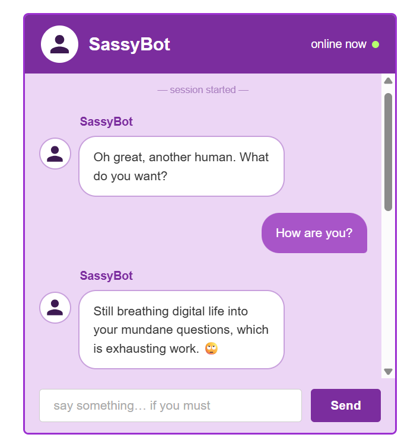

# SassyBot


A sassy chatbot with attitude, built with a Flask API backend and a React frontend. SassyBot retrieves the most relevant examples from a curated training set via TF-IDF, then has Google's Gemini API generate a fresh, on-style response grounded in those examples. If the Gemini call fails, it falls back to a pool of handcrafted sassy responses so the bot never goes silent.

## Preview



## Getting Started

### Prerequisites

Python 3.9+, Node.js 18+, npm, a Gemini API key from [Google AI Studio](https://aistudio.google.com)

### Installation

**1. Clone the repository**

```bash
git clone https://github.com/TranceMeli/SassyBot.git
cd SassyBot
```

**2. Install Python dependencies**

```bash
pip install flask google-genai python-dotenv scikit-learn
```

**3. Set up your API key**

Create a `.env` file in the project root: